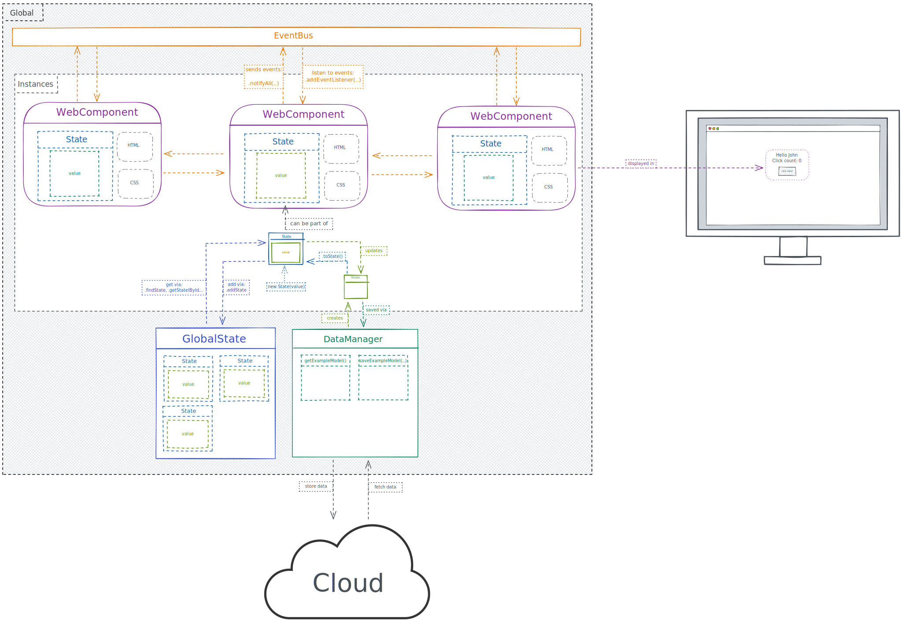

## 📖 Docs

### How to: Create Components

*tldr: Extend `WebComponent` to define your own components.*

1. Create an html (and css) file for your component in a new folder
2. Create a new ts class that extends `WebComponent`
3. Use the component either in HTML or in TypeScript:
   - in HTML: `<my-component></my-component>`
   - in TypeScript: `const myComponent = new MyComponent()`
4. (don't forget to call `WebComponentLoader.loadAll().then(() => {...})` at the start of your application)

For examples, see the [ExampleWebComponent](/src/components/ExampleComponent/)

### How to: Communicate

*tldr: Communication is based on the pubSub pattern. Extend `Observable` to make your class observable, use `EventBus` for global communication.*

#### Observable

Extending `Observable` provides a class with basic pubSub functionality:
1. create a class that extends `Observable`
2. call `.addEventListener` on objects of that class to subscribe to events
3. call `notifyAll` to publish an event to all subscribers

For an example, see [Observable](/src/lib/events/Observable.ts)

#### EventBus

If you wish to send global events, you can use the `EventBus` class:
1. import the `EventBus` singleton 
2. call `.addEventListener` to subscribe to events
3. call `.notifyAll` to publish an event to all subscribers

For an example, see [EventBus](/src/lib/events/EventBus.ts)

### How to: Manage state

*tldr: Create Models to define data structures, store them in ModelStore and use them via ViewModels in your Components. Use LiveValue to make any other object observable.*

#### Model

`Model` represents a basic data structure thats used in your application.
1. extend `Model` and define the properties of your model

For an example, see [Model](/src/data/models/ExampleModel.ts)

#### ModelStore

`ModelStore` is a singleton, where all Models should be stored. That way, they can be accessed from anywhere in the application.
1. import the `ModelStore` singleton
2. use `ModelStore.addModel(model)` to add a model to the store
3. use ModelStore.findModel(), ModelStore.findModels() and ModelStore.getModelById() retrieve models from the store

For an example, see [ModelStore](/src/lib/data/ModelStore.ts)

#### LiveValue

`LiveValue` is a wrapper class that allows you to make any existing object observable.
1. use `new LiveValue(value)` to create a new `LiveValue` object
2. call `.addEventListener` to subscribe to changes
3. call `liveData.value` to get the current value
4. call `liveData.value = newValue` to update the value

For an example, see [LiveValue](/src/lib/data/LiveValue.ts)

#### ViewModel

`ViewModel` is a wrapper class that wraps any Model in a LiveValue object. Use ViewModels instead of Models in your components if you want to keep the state of your component separate from the state of your application.
1. call `model.getViewModel()` to get the ViewModel instance of your model
2. use the `LiveValue` methods detailed above to get, set and listen to value changes of the Model

For an example, see [ViewModel](/src/lib/data/ViewModel.ts)

## 🌅 Cheat Sheet

